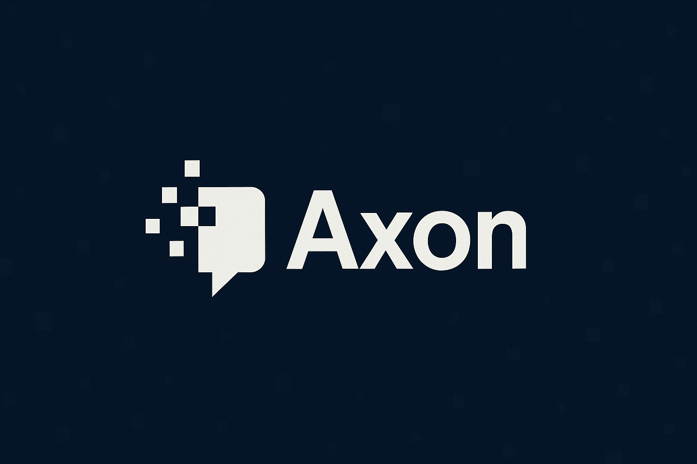

# Axon - AI Coding Assistant for Acode

<div align="center">
  
  
  **Smart AI pair programmer that integrates seamlessly into Acode editor**
</div>

## Features

- **Multi-Provider AI Support**: Choose from OpenAI, Anthropic, Google Gemini, Groq, and Mistral AI
- **Context-Aware Assistance**: Automatically includes your current file's code for better suggestions
- **Code Generation**: Generate functions, classes, and complete modules
- **Code Refactoring**: Improve existing code for better readability and performance
- **Debugging Help**: Identify and fix errors in your code
- **Code Explanations**: Get clear explanations of complex code snippets
- **Direct Code Insertion**: Insert AI-generated code directly into your editor
- **Secure API Key Storage**: Encrypted storage of your API keys
- **Modern UI**: Clean, responsive chat interface with syntax highlighting

## Setup

1. **Choose your AI provider** in plugin settings:
   - OpenAI (GPT-4)
   - Anthropic (Claude)
   - Google Gemini
   - Groq (Llama 3.3 70B)
   - Mistral AI

2. **Add your API key** in the plugin settings
   - API keys are encrypted and stored securely
   - Get your API key from your chosen provider's dashboard

3. Search "**Axon**" in command palette to open the AI

4. **Start coding** with AI assistance!

## Usage

### Basic Chat
- Open Axon from the command palette
- Ask questions about your code
- Get explanations, suggestions, and solutions

### Code Context
Axon automatically includes your current file's code when you ask questions about:
- Code bugs and errors
- Refactoring suggestions
- Function explanations
- Performance optimization

### Code Insertion
- Click the "Insert Code" button on AI responses
- Code blocks are automatically inserted at your cursor position
- Perfect for implementing AI suggestions quickly

### Example Prompts
```
"Explain this function"
"Fix the bug in this code"
"Refactor this for better performance"
"Add error handling to this function"
"Convert this to TypeScript"
"Write unit tests for this code"
```

## API Key Setup

### OpenAI
1. Visit [OpenAI API](https://platform.openai.com/api-keys)
2. Create a new API key
3. Add it to Axon settings

### Anthropic
1. Visit [Anthropic Console](https://console.anthropic.com/settings/keys)
2. Generate an API key
3. Add it to Axon settings

### Google Gemini
1. Visit [Google AI Studio](https://aistudio.google.com/app/apikey)
2. Create an API key
3. Add it to Axon settings

### Groq
1. Visit [Groq Console](https://console.groq.com/keys)
2. Create an API key
3. Add it to Axon settings

### Mistral AI
1. Visit [Mistral Platform](https://console.mistral.ai/api-keys)
2. Generate an API key
3. Add it to Axon settings

## Security

- API keys are encrypted using AES encryption before storage
- Keys are never logged or transmitted except to the chosen AI provider
- All communication with AI providers uses HTTPS

## Author

**Vivek** ([@itsvks19](https://github.com/itsvks19))
- Email: itsvks19@proton.me
- GitHub: [itsvks19](https://github.com/itsvks19)

## Acknowledgments

- [Acode](https://acode.app) - The amazing code editor for Android
- [LangChain](https://langchain.com) - For AI integration framework
- All AI providers for their excellent APIs

---

<div align="center">
  <strong>Happy Coding with Axon!</strong>
</div>
